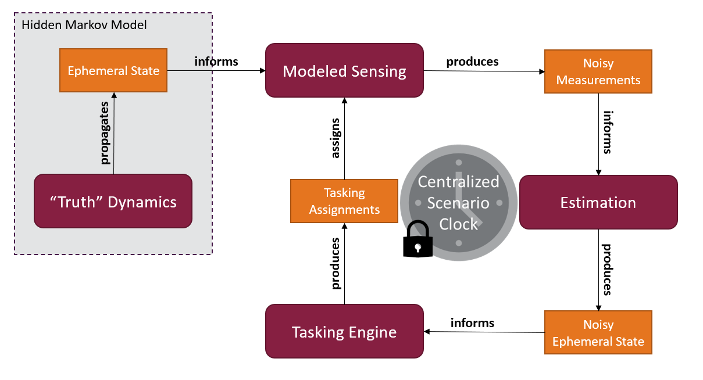

# REsponsive Space ObservatioN Analysis & Autonomous Tasking Engine (RESONAATE)

RESONAATE source code was developed under contract with AFRL/RIED, and is approved for public release under Public Affairs release approval #AFRL-2025-2332.


With the expected resident space object (RSO) population growth and improvements of satellite propulsion capabilities, it has become increasingly apparent that maintaining space domain awareness in future decades will require using human-on-the-loop autonomy as opposed to the current human-in-the-loop methods.
RESONAATE is a decision making algorithm that creates a tasking strategy for a customizable Space Surveillance Network (SSN).
The program presents responsive and autonomous sensor network management for tracking multiple maneuvering and non-maneuvering satellites with a diversely populated space object surveillance and identification (SOSI) network.
The method utilizes a sub-optimal partially observed Markov decision process (POMDP) to task various ground and space-based sensors.
The POMDP implements the largest Lyapunov exponent, the Fisher information gain, and a sensor transportability metric to assess the overall reward for tasking a specific sensor to track a particular satellite.
The successful measurements from the tasked sensors are combined using an unscented Kalman filter to maintain viable orbit estimates for all targets.



______________________________________________________________________

<!-- START TOC -->

**Table of Contents**

- [REsponsive Space ObservatioN Analysis & Autonomous Tasking Engine (RESONAATE)](#responsive-space-observation-analysis--autonomous-tasking-engine-resonaate)
  - [Setup](#setup)
    - [Dependencies](#dependencies)
    - [Installation](#installation)
    - [RESONAATE Configuration](#resonaate-configuration)
  - [Usage](#usage)
    - [CLI Tool](#cli-tool)
    - [Initialization](#initialization)
    - [Database Architecture](#database-architecture)
    - [Python Example](#python-example)
  - [Contributing](#contributing)
    - [Linting](#linting)
    - [Testing](#testing)
    - [Generating Documentation](#generating-documentation)
  - [Publications](#publications)
  - [Authors](#authors)

______________________________________________________________________

<!-- END TOC -->

## Setup

### Dependencies

- Python (PIP) Packages
  - [NumPy](https://www.numpy.org/)
  - [SciPy](https://www.scipy.org/scipylib/index.html)
  - [SQLAlchemy](https://www.sqlalchemy.org/)
  - [Pydantic](https://docs.pydantic.dev/latest/)
  - [Ray Core](https://docs.ray.io/en/latest/ray-core/walkthrough.html)
  - [SGP4](https://pypi.org/project/sgp4/)
- Software
  - [Python >= 3.9](https://www.python.org)

Additional optional dependancies are documented in `pyproject.toml`.

### Installation

See [Installation](./docs/source/intro/install.md#installation) for details on installing the `resonaate` Python package and its dependencies.

### RESONAATE Configuration

By default, RESONAATE will use the default settings defined in `src/resonaate/common/default_behavior.config`.
These values correspond to how RESONAATE behaves with respect to logging, database, debugging, and parallelization.
To overwrite these settings, please copy the contents of `src/resonaate/common/default_behavior.config` to a new `.config` file to save the default settings.
Edit by uncommenting and changing the required values.

## Usage

RESONAATE's modeling and simulation capabilities are accessible via its command line interface (CLI) entrypoint.

### CLI Tool

- Run an example simulation, replacing `<init_file>` and `<number_of_hours>` with appropriate values

  ```bash
  resonaate <init_file> -t <number_of_hours>
  ```

- Command line arguments for `resonaate` entry point:

  ```bash
  usage: resonaate [-h] [-t HOURS] [--debug] [-d DB_PATH] [-i IMPORTER_DB_PATH] INIT_FILE

  RESONAATE Command Line Interface

  positional arguments:
    INIT_FILE             Path to RESONAATE initialization message file

  optional arguments:
    -h, --help            show this help message and exit
    -t HOURS, --time HOURS
                          Time in hours to simulate. DEFAULT: 1/2 hour
    --debug               Turns on parallel debug mode

  Database Files:
    -d DB_PATH, --db-path DB_PATH
                          Path to RESONAATE database
    -i IMPORTER_DB_PATH, --importer-db-path IMPORTER_DB_PATH
                          Path to Importer database
  ```

### Initialization

RESONAATE allows the user to run custom scenarios which are specified in an "init message" JSON file.
This repository includes several example "init messages" under `configs/json/`.

For example, `main_init.json`:

```json
{
  "time": {
    "start_timestamp": "2021-03-30T16:00:00.000Z",
    "physics_step_sec": 300,
    "output_step_sec": 300,
    "stop_timestamp": "2021-03-30T17:00:00.000Z"
  },
  "noise": {
    "init_position_std_km": 1e-3,
    "init_velocity_std_km_p_sec": 1e-6,
    "filter_noise_type": "continuous_white_noise",
    "filter_noise_magnitude": 3.0e-14,
    "random_seed": "os"
  },
  "propagation": {
    "propagation_model": "special_perturbations",
    "integration_method": "RK45",
    "station_keeping": true,
    "target_realtime_propagation": true,
    "sensor_realtime_propagation": true
  },
  "observation": {
    "background": true
  },
  "geopotential": {
    "model": "egm96.txt",
    "degree": 2,
    "order": 0
  },
  "perturbations": {
    "third_bodies": ["moon"],
    "solar_radiation_pressure": false,
    "general_relativity": false
  },
  "estimation": {
    "sequential_filter": {
      "name": "unscented_kalman_filter",
      "parameters": {
        "alpha": 0.05,
        "beta": 2.0
      },
      "dynamics_model": "special_perturbations",
      "maneuver_detection": null
    },
    "adaptive_filter": null
  },
  "engines_files": ["engines/summation_ssn.json"],
  "events": []
}
```

The "init message" is divided into several sections, each responsible for different aspects of the specified simulation run.
At the top level, things like the propagation and estimation models are described.
A user also must define engine configuration file(s) which specify how to task the nested target and sensor configurations.

The initialization/configuration file structure required to run RESONAATE is described in detail by the [Config Specification](./docs/source/reference/config_format.md) documentation.

### Database Architecture

When interacting with the `resonaate` CLI, users may specify two separate types of databases: `ResonaateDatabase` (aka internal) and `ImporterDatabase` (aka external).

The internal `ResonaateDatabase` defines where data _produced_ by RESONAATE is stored.
Users may save the database to a specific database file with the `-d` or `--db-path` CLI options to `resonaate` (recommended).
The `--db-path` option requires explicit selection of the file location.

The external `ImporterDatabase` defines **read-only** data that RESONAATE will ingest during a simulation and mix with produced data, but is protected from being written to by RESONAATE.
This provides utility for loading large sets of pre-computed data (truth, observations, tasks); testing fusion of external estimates or observations with internally generated estimates and observations; and stacking data from simulation runs together.
Users can specify the `ImporterDatabase` file path with the `-i` or `--importer-db-path` CLI options to `resonaate`.

### Python Example

If users wish to incorporate RESONAATE into a separate tool, they can start with this minimal example that will properly run a simulation.

```python
# Standard Library Imports
from datetime import timedelta

# RESONAATE Imports
from resonaate.common.logger import Logger
from resonaate.data.resonaate_database import ResonaateDatabase
from .physics.time.conversions import getTargetJulianDate
from .scenario import buildScenarioFromConfigFile

# Points to a valid main configuration file
init_file = "scenarios/main/test1.json"

# Define custom logger object which logs to the console
logger = Logger("resonaate", path="stdout")

# Define internal database instance explicitly
db_path = "db/resonaate.sqlite3"

# Build the Scenario application from the JSON init
scenario = buildScenarioFromConfigFile(
    init_file,  # Initialization file/scenario config
    db_path,  # Path to `ResonaateDatabase` file
    internal_db_path=None,  # No imported data
)

# Determine final time as a Julian date
target_date = getTargetJulianDate(
    scenario.clock.julian_date_start, timedelta(hours=sim_time_hours)
)

try:
    # Step through simulation
    scenario.propagateTo(target_date)
except KeyboardInterrupt:
    # Notification simulation stopped via KeyboardInterrupt
    scenario.logger.warning("Simulation terminated")
else:
    # Notification simulation stopped gracefully
    scenario.logger.info("Simulation complete")
finally:
    # Gracefully shutdown the simulation
    scenario.shutdown()
```

> NOTE: If you are not using `buildScenarioFromConfigFile()`, you must call `setDBPath()` before any database
> queries are required.

## Contributing

Please see [CONTRIBUTING](CONTRIBUTING.md) for more thorough details.

Using these development tools requires a standalone version of RESONAATE to be installed.
To install compatible, up-to-date versions please install RESONAATE with the following commands:

```bash
make install
```

### Linting

- Running linter target:

  ```bash
  make lint
  ```

### Testing

- Run unit tests only (~30 s)

  ```bash
  make test
  ```

- Run entire test suite (~4 m)

  ```bash
  make test_all
  ```

- Include coverage results

  ```bash
  make coverage
  ```

### Generating Documentation

- Build and serve the documentation

  ```bash
  make doc
  ```

- Open [http://localhost:8000/](http://localhost:8000/) in a browser

## Publications

For additional information on the development of the RESONAATE Tool, see the following publications:

- Dynamically Tracking Maneuvering Spacecraft with a Globally-Distributed, Heterogeneous Wireless Sensor Network
  - AIAA Space, 2017
  - Digital Object Identifier (DOI) : 10.2514/6.2017-5172
- An Autonomous Sensor Management Strategy for Monitoring a Dynamic Space Domain with Diverse Sensors
  - AIAA SciTech, 2018
  - Digital Object Identifier (DOI) : 10.2514/6.2018-0890
- Autonomous Multi-Phenomenology Space Domain Sensor Tasking and Adaptive Estimation
  - IEEE Fusion, 2018
  - Digital Object Identifier (DOI) : 10.23919/ICIF.2018.8455863
- Adaptively Tracking Maneuvering Spacecraft with a Globally Distributed, Diversely Populated Surveillance Network
  - Journal of Guidance, Control, and Dynamics, 2018
  - Digital Object Identifier (DOI) : 10.2514/1.G003743
- Autonomous and Responsive Surveillance Network Management for Adaptive Space Situational Awareness
  - Virginia Tech Dissertation, 2018
  - Digital Object Identifier (DOI) : 10919/84931
- Parametric Analysis of an Autonomous Sensor Tasking Engine for Spacecraft Tracking
  - AIAA SciTech, 2021
  - Digital Object Identifier (DOI) : 10.2514/6.2021-1397

## Authors

- Project Principal Investigators
  - Dr. Jonathan Black: <jonathan.black@vt.edu>
  - Dr. Kevin Schroeder: <kschro1@vt.edu>
- Core Developers
  - Dylan Thomas: <dylan.thomas@vt.edu>
  - David Kusterer: <kdavid13@vt.edu>
  - Jon Kadan: <jkadan@vt.edu>
  - Cameron Harris: <camerondh@vt.edu>
  - Monty Campbell: <mcampbell02@vt.edu>
- Contributors
  - Connor Segal: <csegal@vt.edu>
  - Amit Bala: <agbala@vt.edu>
  - Dylan Penn: <dylanrpenn@vt.edu>
